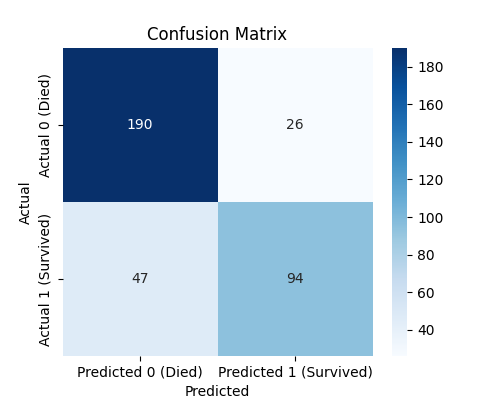
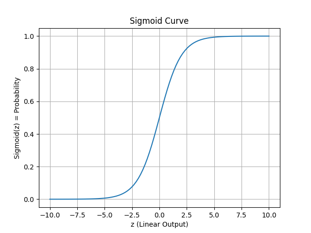

#  Logistic Regression on Titanic Dataset

This project demonstrates how to use **Logistic Regression** to predict survival outcomes of Titanic passengers using features like age, class, sex, fare, and family members.

---

##  Agenda

-  What is Logistic Regression?
-  Why use Logistic Regression for classification problems
-  Understanding the Sigmoid Function
-  Titanic Dataset Overview
-  Data Cleaning & Preprocessing
  - Handling missing values
  - Dropping irrelevant columns
  - Encoding categorical features (`Sex`, `Embarked`)
-  Feature Selection
-  Splitting Data (Train/Test)
-  Model Training using Logistic Regression
-  Making Predictions
-  Evaluating Model
  - Accuracy Score
  - Confusion Matrix
-  Interpreting Model Weights (Feature Impact)
-  Sigmoid Function

---

##  What is Logistic Regression?

Logistic Regression is a **supervised machine learning** algorithm used for **binary classification** problems.  
It predicts the probability of a class (e.g., survived = 1 or died = 0) using the **sigmoid function**.

###  Sigmoid Function:

\[
\sigma(z) = \frac{1}{1 + e^{-z}}
\]

- If sigmoid(z) > 0.5 → predict 1 (survived)  
- Else → predict 0 (died)

---

##  Dataset Used

- Source: `titanic.csv`
- Target: `Survived` (0 = died, 1 = survived)

---

##  Data Preprocessing

- Dropped unnecessary columns: `PassengerId`, `Name`, `Ticket`, `Cabin`
- Filled missing `Age` values with the **mean**
- Filled missing `Embarked` values with the **mode**
- Converted categorical features to numeric:
  - `Sex`: male → 0, female → 1
  - `Embarked`: S → 0, C → 1, Q → 2
- Saved cleaned data as `titanic_clean.csv`

---

##  Features Used

```python
['Sex', 'Pclass', 'Age', 'SibSp', 'Parch', 'Fare']

Train-Test Split

    x_train, x_test, y_train, y_test = train_test_split(x, y, test_size=0.4, random_state=42)

Model Training

    model = LogisticRegression()
    model.fit(x_train, y_train)

        This trains a logistic regression model using your training data. The model learns patterns to classify passengers as survived or not.

Predictions

    y_pred = model.predict(x_test)

        This uses the trained model to predict survival outcomes on the test data.

Confusion Matrix

    cm = confusion_matrix(y_test, y_pred)

        Gives a breakdown of correct and incorrect predictions: true positives, false positives, etc.

        Where the model is doing well (TN and TP)
        Where it making mistakes (FP and FN)

        output of confusion matrix:
        [[92 13]
        [21 53]]

        92: Correctly predicted as died (TN)-------------->True Negative 

        53: Correctly predicted as survived (TP)---------->True Positive

        13: Died but predicted as survived (FP)----------->False Positive

        21: Survived but predicted as died (FN)----------->False Negative

       Confusion Matrix Visualization

       

Sigmoid Function Formula:

    z = w1x1 + w2x2 + .......+b  (linear output)
    σ(z) = probability of class 1 (e.g., survived)

What happens after?

    Model calculates z
        z = wx+b

    Applies sigmoid:
        Converts z → probability (between 0 and 1)

    Makes prediction:
        If σ(z)>0.5 → predict 1
        Else → predict 0

Sigmoid Function picture 

    
